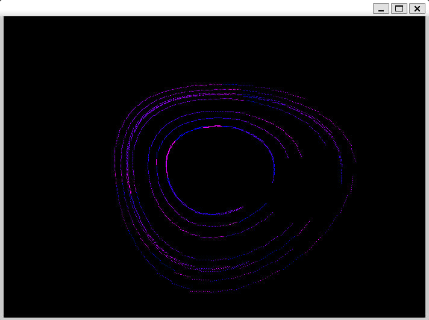
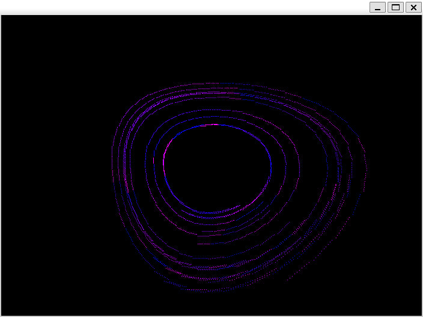

## Simple graphical example for future programs

It calculates and shows you these beautiful images:





Folder `llir` also has LLVM IR outpur for main calculational module for 4 different optimisation settings!

## Usage:

Prerequisets:
```
sudo apt install libsdl2-dev
sudo apt install clang
```

To compile and run:
```
bash comrun.sh
```

To generate llir:
```
bash getll.sh
```

