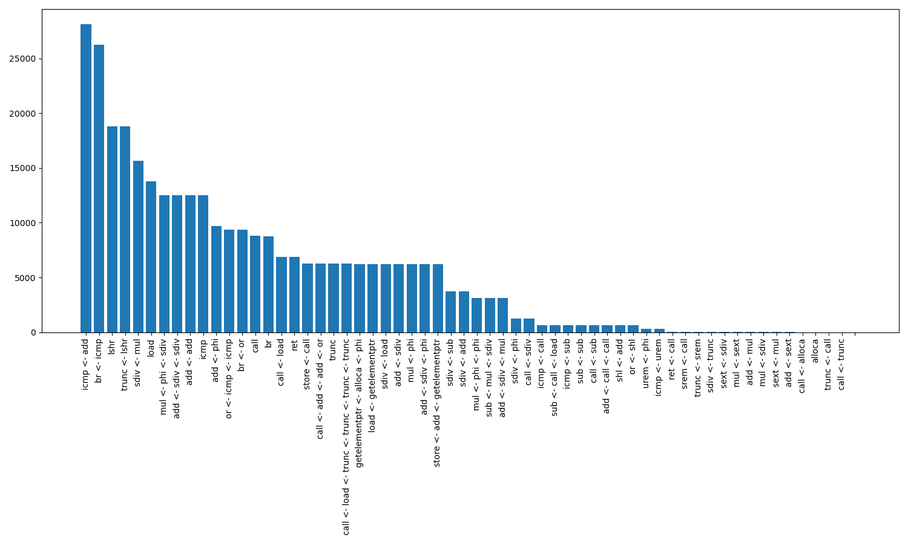

## Example of adding my own pass to LLVM to collect stats

It adds call to log function after every LLIR instruction. To compile it, run `bash comrun.sh`. Using this info you can collect and analyze stats. To do so, run `a.out > stats.txt` and then `py analyse.py`.

## Result

Total: 64 instrs combos; top 30 of them:

inst <- dependency | count
--- | ---
icmp <- add | 28097
br <- icmp | 26243
lshr | 18780
trunc <- lshr | 18780
sdiv <- mul | 15626
load | 13776
mul <- phi <- sdiv | 12520
add <- sdiv <- sdiv | 12520
add <- add | 12520
icmp | 12520
add <- phi | 9675
or <- icmp <- icmp | 9366
br <- or | 9366
call | 8811
br | 8769
call <- load | 6890
ret | 6887
store <- call | 6261
call <- add <- add <- or | 6260
trunc | 6260
call <- load <- trunc <- trunc <- trunc <- trunc | 6260
getelementptr <- alloca <- phi | 6212
load <- getelementptr | 6212
sdiv <- load | 6212
add <- sdiv | 6212
mul <- phi | 6212
add <- sdiv <- phi | 6210
store <- add <- getelementptr | 6210
sdiv <- sub | 3732
sdiv <- add | 3732
